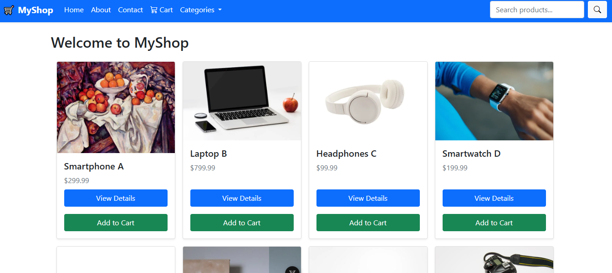
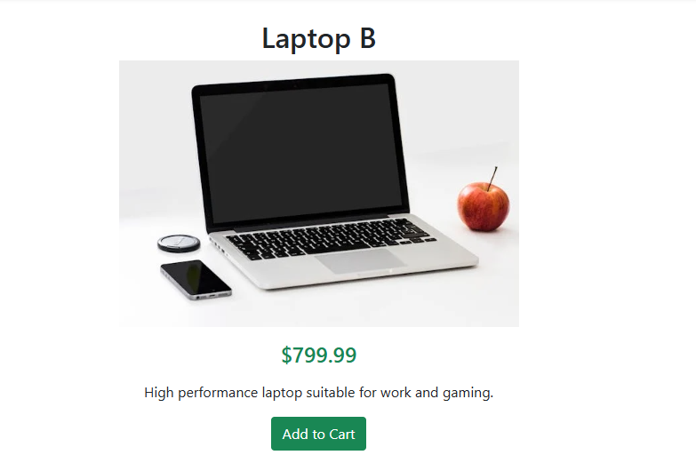
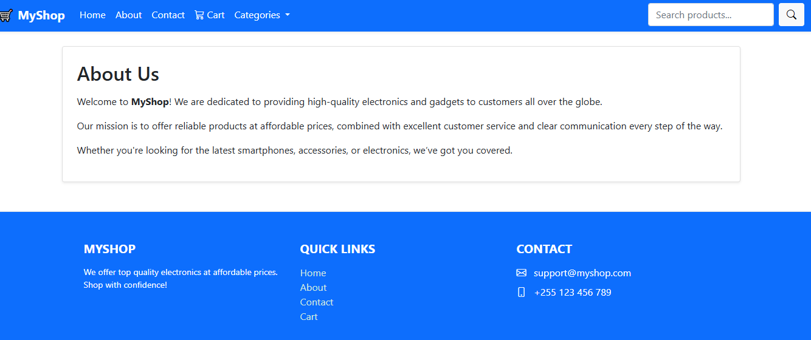
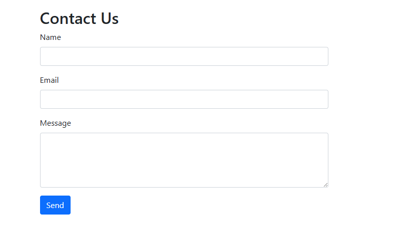
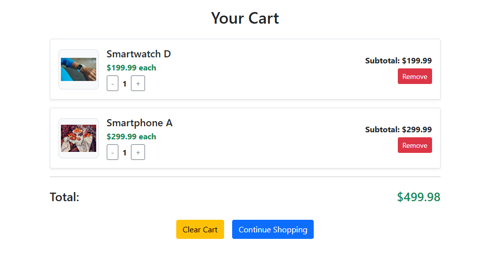

# 🛒 Vue E-Commerce System

A modern and responsive e-commerce website built with **Vue 3**. Users can browse products, view detailed information, add items to the cart, and manage their cart easily. It uses Vue Router for navigation and a reactive cart with localStorage for persistence.

🔗 **Live Demo:**  
🌐 [https://vuecommercesystem.netlify.app](https://vuecommercesystem.netlify.app)

---

## 📸 Screenshot

> 📷 Make sure to place your screenshot at `public/screenshot.png` or update the path below.







---

## ✨ Features

- ✅ Product listing with name, price, and image
- ✅ Product detail page with description
- ✅ Add to Cart functionality
- ✅ Increase/decrease quantity in cart
- ✅ Remove items from cart
- ✅ Cart total and subtotal calculation
- ✅ Persistent cart using `localStorage`
- ✅ Responsive UI with Bootstrap 5

---

## ⚙️ Tech Stack

- **Vue 3**
- **Vue Router**
- **Vite**
- **Bootstrap 5**
- **localStorage** (for persistent cart)

---

## 📁 Project Structure

vue-ecommerce/
│
├── public/
│ └── screenshot.png # App screenshot
│
├── src/
│ ├── components/ # UI components
│ ├── pages/ # Home, Detail, Cart
│ ├── router/ # Vue Router config
│ └── stores/ # cartStore.js (reactive cart)
│
├── README.md # This file
└── package.json

## 🚀 Getting Started

### Clone the Repository

```bash
git clone https://github.com/athumaniMfaume/vue-ecommerce.git
cd vue-ecommerce

Install Dependencies

npm install

npm run dev

👤 Author
Athumani Mfaume Jr.
📧 athumanimfaume1995@gmail.com
🌐 LinkedIn
```
